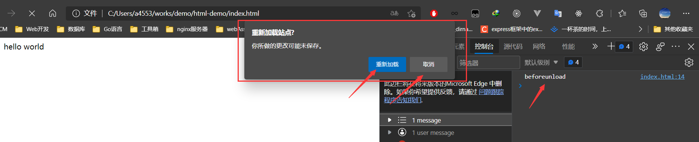

# 页面生命周期

[toc]

用户从打开页面、加载页面、到关闭页面有一系列的生命周期，就类似于Vue组件创建、挂载，卸载一样。

而在HTML 页面的生命周期包含三个重要事件：

- `DOMContentLoaded` —— 浏览器已完全加载 HTML，并构建了 DOM 树，但像 `` 和样式表之类的外部资源可能尚未加载完成。
- `load` —— 浏览器不仅加载完成了 HTML，还加载完成了所有外部资源：图片，样式等。
- `beforeunload/unload` —— 当用户正在离开页面时。

下面我们分别来认识这三个生命周期事件

## DOMContentLoaded事件

**浏览器已完全加载 HTML，并构建了 DOM 树**, 但是一些外部资源还没有加载完成

下面看一个例子

```html
<!DOCTYPE html>
<html lang="en">

<head>
  <title>Document</title>
</head>

<body>
  <div id="box">hello world</div>
  
</body>

<script>
  // DOMContentLoaded 事件发生在 document 对象上。
  // 我们必须使用 addEventListener 来捕获它：
  document.addEventListener("DOMContentLoaded", function () {
    // 但页面html解析Dom Tree完成会执行该函数，
    // 所以这个生命周期也叫DOMContentLoaded, 即 DOM内容加载完成

    const box = document.getElementById('box'); // 获得box元素
    const img = document.getElementById('img'); // 获得img元素
    console.log(`Div box innerHTML: ${box.innerHTML}`); // Div box innerHTML: hello world
    // 图片目前尚未加载完成，所以图片的大小为 0x0
    console.log(`Image size: ${img.offsetWidth}x${img.offsetHeight}`); // Image size: 0x0
  });
</script>

</html>
```


## load事件

当整个页面，包括样式、图片和其他资源被加载完成时，会触发 `window` 对象上的 `load` 事件。可以通过 `onload` 属性获取此事件。

load事件就代表整个页面的资源都加载完毕，即我们可以获得页面上的图片资源等信息

同样的看个例子

```html
<!DOCTYPE html>
<html lang="en">

<head>
  <title>Document</title>
</head>

<body>
  <div id="box">hello world</div>
  
</body>

<script>
  // 页面加载完毕会触发window上的load事件
  // 我们可以通过onload给window注册该事件的回调函数
  window.onload = function () {
    // 页面不仅需要等待Dom Tree解析完成，
    // 还要等待样式、图片和其他资源都加载完毕后才会执行该回调函数，

    const box = document.getElementById('box'); // 获得box元素
    const img = document.getElementById('img'); // 获得img元素
    console.log(`Div box innerHTML: ${box.innerHTML}`); // Div box innerHTML: hello world
    // 图片加载完成，所以图片的大小为 177x160
    console.log(`Image size: ${img.offsetWidth}x${img.offsetHeight}`); // Image size: 177x160
  }
</script>

</html>
```


## beforeunload事件

但用户试图关闭窗口/试图离开页面的时候(在该窗口上输入其他网址，加载其他页面)就会触发beforeunload事件，在这个时刻用户还没有真正离开页面，只是在离开之前。

我们在这个生命周期事件里可以完成很有趣的事情, 但用户想要离开的时候我们可以询问用户是否真正想离开。

看下面的例子

```html
<!DOCTYPE html>
<html lang="en">

<head>
  <title>Document</title>
</head>

<body>
  <div id="box">hello world</div>
</body>

<script>
  window.onbeforeunload = function () {
    console.log('beforeunload'); // 用户试图离开页面的时候会触发该函数
    return false; // 返回一个false值，会让浏览器去询问用户是否要真正离开
  };
</script>

</html>
```





## 总结

页面生命周期事件：

- 当 DOM 准备就绪时，`document` 上的 `DOMContentLoaded` 事件就会被触发。
- 当页面和所有资源都加载完成时，`window` 上的 `load` 事件就会被触发。
- 当用户想要离开页面时，`window` 上的 `beforeunload` 事件就会被触发。如果我们取消这个事件，浏览器就会询问我们是否真的要离开（例如，我们有未保存的更改）。
- 当用户最终离开时，`window` 上的 `unload` 事件就会被触发。由于很少使用，这里不做过多的介绍。