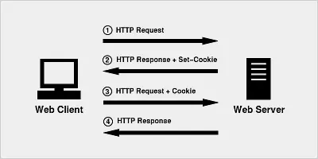
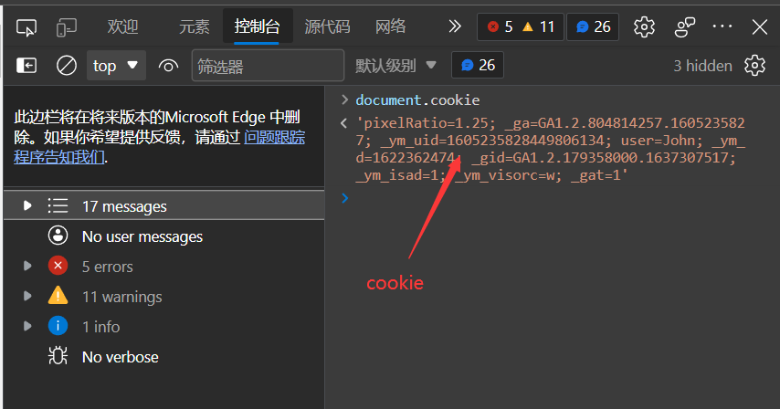

# Cookie

在学习一个新的知识点前，我们应该明白自己的学习目标，要带着疑问去学习，

所以我们首先需要了解Cookie是什么？

## 什么是cookie

HTTP协议本身是无状态的。什么是无状态呢，即服务器无法判断用户身份。Cookie实际上是一小段的文本信息（key-value格式）。客户端向服务器发起请求，如果服务器需要记录该用户状态，就使用response向客户端浏览器颁发一个Cookie。客户端浏览器会把Cookie保存起来。当浏览器再请求该网站时，浏览器把请求的网址连同该Cookie一同提交给服务器。服务器检查该Cookie，以此来辨认用户状态。

打个比方，我们去银行办理储蓄业务，第一次给你办了张银行卡，里面存放了身份证、密码、手机等个人信息。当你下次再来这个银行时，银行机器能识别你的卡，从而能够直接办理业务。

##  Cookie的机制

当用户第一次访问并登陆一个网站的时候，cookie的设置以及发送会经历以下4个步骤：

**客户端发送一个请求到服务器** --》 **服务器发送一个HttpResponse响应到客户端，其中包含Set-Cookie的头部** --》 **客户端保存cookie，之后向服务器发送请求时，HttpRequest请求中会包含一个Cookie的头部** --》**服务器返回响应数据**




在这里我们总结一下

现在我们可以回答什么是Cookie这个问题了。

Cookie 是直接存储在浏览器中的一小串数据。

Cookie 通常是由 Web 服务器使用响应 `Set-Cookie` HTTP-header 设置的。然后浏览器使用 `Cookie` HTTP-header 将它们自动添加到每个对相同域的请求中。

我们可以使用JS中的`Document.cookie`对象查看浏览器的cookie



我们可以看到cookie有点类似于键值对的形式，使用等号进行连接。如上图的`_gat=1` , `user=John`。

## Cookie属性值

除了以键值对的方式存在，Cookie还能设置很多属性，对Cookie进行配置。现在我们来了解下这些属性

### expires，max-age

默认情况下，如果一个 cookie 没有设置这两个参数中的任何一个，那么在关闭浏览器之后，它就会消失。此类 cookie 被称为 "session cookie”。

为了让 cookie 在浏览器关闭后仍然存在，我们可以设置 `expires` 或 `max-age` 选项中的一个。

其中`expires`就是**到期时间**，当 cookie 的到期日期到来的时候，那时浏览器会自动删除它。

- **`expires=Tue, 19 Jan 2038 03:14:07 GMT`**

而其中`max-age`就是cookie的**最大存活时间**

```js
// cookie 会在一小时后失效
document.cookie = "user=John; max-age=3600";

// 删除 cookie（让它立即失效）
document.cookie = "user=John; max-age=0";
```

### domain

首先我们要了解下，域和子域的概念。域由许多部分构成，也有父域和子域的概念。如`site.com`是一个父域，`forum.site.com`就是他的子域。我们发现他们的域名最后一部分是相同的。这是因为域名是从后向前构成的。

默认情况下，cookie 只有同一个域才能访问到，如果 cookie 设置在 `site.com` 下，我们在 `other.com` 下就无法获取它。但是棘手的是，我们在子域 `forum.site.com` 下也无法获取它！

**无法使 cookie 可以被从另一个二级域访问，因此，`other.com` 将永远不会收到设置在 `site.com` 的 cookie。**

所以我们可以设置cookie的域名属性，即设置cookie能够访问的范围。

就想这样子

```js
// 在 site.com
// 使 cookie 可以被在任何子域 *.site.com 访问：
document.cookie = "user=John; domain=site.com"

// 我们将 domain 选项显式地设置为根域：domain=site.com：
```

这样只要在`site.com`的子域下都能过访问到了。

### secure

**默认情况下，如果我们在 `http://site.com` 上设置了 cookie，那么该 cookie 也会出现在 `https://site.com` 上，反之亦然。**

也就是说，cookie 是基于域的，它们不区分协议。

```js
// 假设我们现在在 HTTPS 环境下
// 设置 cookie secure（只在 HTTPS 环境下可访问）
document.cookie = "user=John; secure";
// 使用此选项，如果一个 cookie 是通过 https://site.com 设置的，那么它不会在相同域的 HTTP 环境下出现，例如 http://site.com。
```

保障了cookie是区分协议的http与https的保密性不同。

### httpOnly

Web 服务器使用 `Set-Cookie` header 来设置 cookie。并且，它可以设置 `httpOnly` 选项。

这个选项禁止任何 JavaScript 访问 cookie。我们使用 `document.cookie` 看不到此类 cookie，也无法对此类 cookie 进行操作。

这是一种预防措施，当黑客将自己的 JavaScript 代码注入网页，并等待用户访问该页面时发起攻击，而这个选项可以防止此时的这种攻击。这应该是不可能发生的，黑客应该无法将他们的代码注入我们的网站，但是网站有可能存在 bug，使得黑客能够实现这样的操作。

```js
document.cookie = 'cookiename=value;HTTPOnly;'
```

若cookie设置了HTTPOnly，则我们无法通过document.cookie访问到此类cookie
