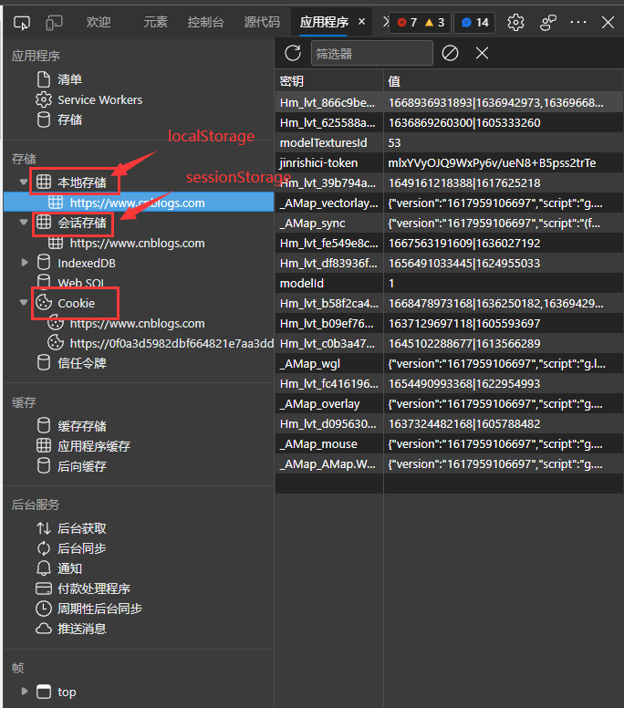

# SessionStorage、LocalStorage

## 简介

在HTML5之前，开发人员一般是通过使用Cookie在客户端保存一些简单的信息的。在HTML5发布后，提供了一种新的客户端本地保存数据的方法，那就是Web Storage，它也被分为：LocalStorage和SessionStorage，它允许通过JavaScript在Web浏览器中以键值对的形式保存数据。而相比Cookie有如下优点：

1. 拥有更大的存储容量，Cookie是4k，Web Storage为5M。
2. 操作数据相比Cookie更简单。
3. 不会随着每次请求发送到服务端。



我们可以通过调试器的应用程序查看存放在页面的`localStorage`, `sessionStorage`,`cookie`

下面我们就来学习如何使用。

## 如何使用Storage

其中localStorage 和sessionStorage的调用方法几乎一模一样，不同的是他们存储数据的时间。这个我们后文再说。

废话不多说，我们直接通过例子来看。

```js
// 存储键/值对
localStorage.setItem('name', 'chenchen');
sessionStorage.setItem('name', 'xx');

// 按照键获取值
localStorage.getItem('name'); // chenchen
sessionStorage.getItem('name'); // xx

// 删除键及其对应的值。
localStorage.removeItem('name');
sessionStorage.removeItem('name');

// 删除所有数据。
localStorage.clear();
sessionStorage.clear();

// 存储的内容的长度
console.log(localStorage.length);
console.log(sessionStorage.length);

// more...
```

**既然localStorage和sessionStorage使用方法几乎一模一样，为什么还有两种不同的storage呢**

## localStorage、sessionStorage区别

`localStorage` 最主要的特点是

1. 在同源的所有标签页和窗口之间共享数据。
2. 数据不会过期。它在浏览器重启甚至系统重启后仍然存在。

而`sessionStorage` 的主要特点有：

1. 数据在页面刷新后仍然保留，但在关闭/重新打开浏览器标签页后不会被保留。
2. 只存在于当前浏览器标签页。SessionStorage数据独立于其他选项卡和窗口。哪怕是同源的标签页，sessionStorage之间的数据也是独立的。

因此sessionStorage 和 localStorage 的主要区别在于他们存储数据的生命周期，sessionStorage 存储的数据的生命周期是一个会话，而 localStorage存储的数据的生命周期是永久，除非主动删除数据，否则永远不会过期。

## 总结

Web 存储对象 `localStorage` 和 `sessionStorage` 允许我们在浏览器中保存键/值对。

- `key` 和 `value` 都必须为字符串。
- 存储大小限制为 5MB+，
- 数据绑定到源（域/端口/协议）

| localStorage                         | sessionStorage                                         |
| ------------------------------------ | ------------------------------------------------------ |
| 在同源的所有标签页和窗口之间共享数据 | 在当前浏览器标签页中可见                               |
| 浏览器重启后数据仍然保留             | 页面刷新后数据仍然保留（但标签页关闭后数据则不再保留） |

