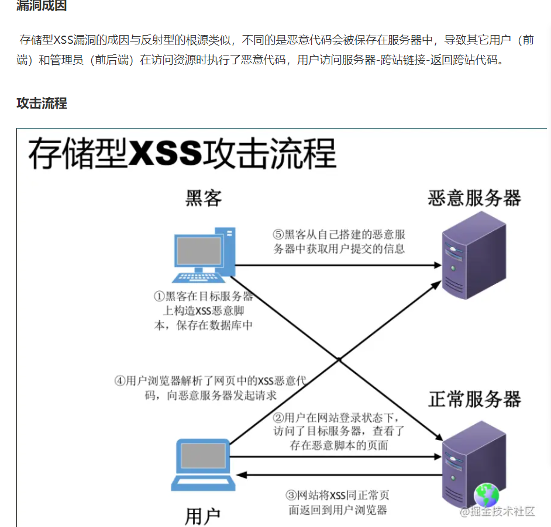

# 网络面试题补充

## http缓存

- 对http缓存了解多少？

  当浏览器首次访问一个网站，浏览器向服务器发送一个http请求，服务器返回这个网页所有的资源。浏览器采用缓存策略，存储所有资源的副本。当再次访问这个网站，直接请求资源的副本，更快的加载出页面。

- http协商缓存服务器是如何通过什么具体的header，通知客户端

- 协商缓存http请求header信息。

## 跨域

为了保护用户的数据安全，浏览器采用同源策略。即：请求的url地址必须和浏览器上的URL地址处于同域上（域名，端口，协议相同）

- 对跨域了解多少？

  跨域就不同域之间相互请求资源

- 解决跨域的方法有什么？

- JSONP的优势劣势是什么？ CORS的优势劣势是什么？

- 在使用CORS的时候，如何保证请求安全问题？

## 网络安全

- 对网络安全了解多少？

- XSS攻击有哪3种？ 分别是什么，简述一下。有什么比较好的办法去解决XSS攻击。

  

  

  

- 跨域请求伪造是什么？

  XSRF