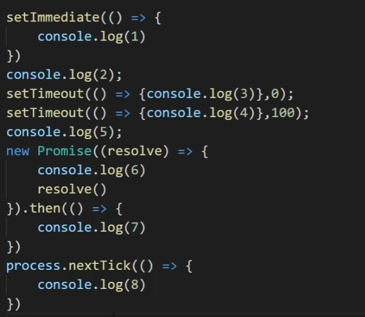
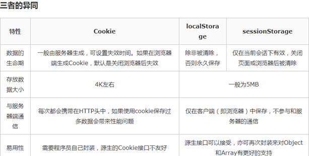

# 面试题

- [x] 能详细讲解TCP三次握手吗？第三次握手发送方是否可以携带信息？一定要三次握手吗，是否只能两次握手？

[详解 TCP 连接的“ 三次握手 ”与“ 四次挥手 ” (baidu.com)](https://baijiahao.baidu.com/s?id=1654225744653405133&wfr=spider&for=pc)

[计算机网络微课堂（有字幕有背景音乐版）_哔哩哔哩_bilibili](https://www.bilibili.com/video/BV1x4411d7HU?p=64)

[计算机网络微课堂（有字幕有背景音乐版）_哔哩哔哩_bilibili](https://www.bilibili.com/video/BV1x4411d7HU?p=65)

- [x] 0.1 + 0.2 === 0.3吗？ 为什么？

  JavaScript 使用 Number 类型来表示数字（整数或浮点数），遵循 IEEE 754 标准，通过 64 位来表示一个数字（1 + 11 + 52）

  - 1 符号位，0 表示正数，1 表示负数 s
  - 11 指数位（e）
  - 52 尾数，小数部分（即有效数字）

  最大安全数字：Number.MAX_SAFE_INTEGER = Math.pow(2, 53) - 1，转换成整数就是 16 位，所以 0.1 === 0.1，是因为通过 toPrecision(16) 去有效位之后，两者是相等的。

  **重点**：

  ​        看似有穷的数字，在计算机的二进制表示里却是无穷的，由于存储位数限制因此存在==舍去==，精度丢失就发生了。==0.1的二进制表示的是一个无限循环小数==，js采用的是浮点数标准需要对这种无限循环的==二进制进行截取==，从而导致了精度丢失，造成了0.1不再是0.1，截断之后就变成了0.10000...001,0.2变成了0.200...002,所以两者相加的数大于0.3。
  
  在两数相加时，会先转换成二进制，0.1 和 0.2 转换成二进制的时候尾数会发生无限循环，然后进行对阶运算，JS 引擎对二进制进行截断，所以造成精度丢失。
  
  所以总结：**精度丢失可能出现在进制转换和对阶运算中**
  
  **解决：**
  
  1、Number((0.1+0.2).toFixed(1))
  
  toFixed方法可以指定运算结果的小数点后的指定位数的数字，使保留一位小数就是toFixed(1)
  
  2、把小数变为整数（乘倍数），再缩小回原来倍数（除倍数）
  
  (0.1×10+0.2×10)/10
  
  3、设置一个误差范围值，通畅称为“机器精度”。

​      [0.1 + 0.2 != 0.3背后的原理 - SegmentFault 思否](https://segmentfault.com/a/1190000015051329)

- [x] Number()存储的空间有多大，如果后端发送一个超过最大字节的数字怎么办？

  根本原因：JavaScript的Number类型有个最大值（安全值），即2的53次方，为9007199254740992。如果超过这个值，那么js会出现不精确的问题。

  解决：

  - 后端使用字符串格式发送数据
  - 控制用户新建数据时id的长度

- [x] 跨域、jsonp原理，CORS原理？

[www.ruanyifeng.com/blog/2016/04/cors.html](http://www.ruanyifeng.com/blog/2016/04/cors.html)

[一分钟说完JSONP请求，面试满分答案ヾ(≧▽≦*)o - 掘金 (juejin.cn)](https://juejin.cn/post/6844903976505344013#heading-0)

## 为什么要有跨域限制

因为存在浏览器同源策略，所以才会有跨域问题。那么浏览器是出于何种原因会有跨域的限制呢。其实不难想到，跨域限制主要的目的就是为了用户的上网安全。

如果浏览器没有同源策略，会存在什么样的安全问题呢。下面从 DOM 同源策略和 XMLHttpRequest 同源策略来举例说明：

**如果没有 DOM 同源策略，也就是说不同域的 iframe 之间可以相互访问，那么黑客可以这样进行攻击：**

1. 做一个假网站，里面用 iframe 嵌套一个银行网站 `http://mybank.com`。
2. 把 iframe 宽高啥的调整到页面全部，这样用户进来除了域名，别的部分和银行的网站没有任何差别。
3. 这时如果用户输入账号密码，我们的主网站可以跨域访问到 `http://mybank.com` 的 dom 节点，就可以拿到用户的账户密码了。

**如果没有 XMLHttpRequest 同源策略，那么黑客可以进行 CSRF（跨站请求伪造） 攻击：**

1. 用户登录了自己的银行页面 `http://mybank.com`，`http://mybank.com` 向用户的 cookie 中添加用户标识。
2. 用户浏览了恶意页面 `http://evil.com`，执行了页面中的恶意 AJAX 请求代码。
3. `http://evil.com` 向 `http://mybank.com` 发起 AJAX HTTP 请求，请求会默认把 `http://mybank.com` 对应 cookie 也同时发送过去。
4. 银行页面从发送的 cookie 中提取用户标识，验证用户无误，response 中返回请求数据。此时数据就泄露了。
5. 而且由于 Ajax 在后台执行，用户无法感知这一过程。

因此，有了浏览器同源策略，我们才能更安全的上网。

作者：laixiangran
链接：https://juejin.cn/post/6844903681683357710

- [x] proxy你了解多少？

[14. Proxy - 概述 - 《阮一峰 ECMAScript 6 (ES6) 标准入门教程 第三版》 - 书栈网 · BookStack](https://www.bookstack.cn/read/es6-3rd/spilt.1.docs-proxy.md)

vue2.0的版本所使用的数据劫持是通过Object.defineProperty( )来劫持了对象属性的getter和setter，从而在数据变动的时候来做一些事情。

vue3使用es6的原生proxy来实现数据劫持。proxy用来更改对象默认的方法。就是在目标对象之前架设了一层拦截，外界对目标对象的访问，都必须要经过这层拦截。因此提供了一种机制，可以对外界的访问进行过滤和改写，等同于在语言层面做出修改，所以属于“元编程”。一般称之为代理器。

es6原生提供proxy构造函数，用于生成proxy实例。

```js
// 目前es6中proxy提供了13种代理操作拦截的行为

let target = {
  name: "cxr",
  todo: "eat"
}
console.log(target.name);//cxr

//proxy拦截行为
let handler = {
  //proxy里,get用来拦截属性的读取操作。接收三个参数(目标对象、属性名、proxy实例本身[可选])
  get: function (target, _p) {
    if (target.name === "cxr") {
      return "woshi"
    }
  },
  // 拦截属性赋值操作，四个参数（目标对象，属性名，属性值，proxy实例本身[可选]）
  set: function (_obj, _prop, _val) {
    if (_prop === "todo") {
      _obj[_prop] = 'sayHi'
    }
  }
}

//创建proxy对象。接收两个参数，第一个是要包装的目标对象，第二个是定制拦截的行为
let proxyObj = new Proxy(target, handler)
console.log(proxyObj.name);//woshi

proxyObj.todo = 123;
console.log(proxyObj);//{ name: 'cxr', todo: 123 }
//拦截之后：Proxy {name: 'cxr', todo: 'sayHi'}
```


==在 Proxy 代理的情况下，目标对象内部的`this`关键字会指向 Proxy 代理。==

```js
const target = {
  m: function () {
    console.log(this === proxy);
  }
};
const handler = {};
const proxy = new Proxy(target, handler);
target.m() // false
proxy.m()  // true
```


- [x] Promise

```js
console.log(1)
new Promise((resolve)=>{
 resolve();
 console.log(2)
}).then(()=>{
 console.log(3) 
})
setTimeOut(function()=>{
 console.log(4)
},0)
console.log(5)
//1,2,5，3,4
```

同步程序，process.nextTick，微任务，宏任务，setImmediate

//2,5,6,8,7,3,1,4



- [x] cookie有哪些属性、大小、浏览器如何禁止别人访问cookie

[Cookie，document.cookie (javascript.info)](https://zh.javascript.info/cookie)

- [x] localStorage，sessionStorage的区别。

[LocalStorage，sessionStorage (javascript.info)](https://zh.javascript.info/localstorage#zong-jie)

localStorage和sessionStorage都是存储客户端临时信息的对象。

不同浏览器无法共享localStorage或sessionStorage的信息，相同浏览器可以共享localStorage信息，无法共享sessionStorage的信息。



- [x] display:none,visibility:hidden,opactiy:0的区别。

[display: none;、visibility: hidden、opacity=0区别总结 - 简书 (jianshu.com)](https://www.jianshu.com/p/e3841171f729)

- ==display:none==

  1、浏览器不会生成display为none的元素

  2、不占据空间，改变此属性会引起重排

  3、不会被子类继承，但子类不显示

  4、transition对其无效

- ==visibility:hidden==

  1、元素虽被隐藏但占据空间

  2、会被子类继承，但子类可以设置visibility:visible来反隐藏

  3、修改此属性会引起重绘

  4、transition对其无效

- ==opacity=0==

  1、设置元素透明度为100%，元素隐藏，但仍然占据空间

  2、会被子类继承，但子类并不能通过opacity=1进行反隐藏

  3、opacityw=0的元素依然能触发已经绑定的事件

  4、transition对其有效

- [x]  js脚本加载问题，async、defer问题

[图解 script 标签中的 async 和 defer 属性 - 掘金 (juejin.cn)](https://juejin.cn/post/6894629999215640583)

浏览器在解析html的时候，遇到==没有任何属性的script标签==，就会暂停解析，发送网络请求获取该js脚本的代码内容，然后让js引擎执行改代码，执行完后再解析。

当浏览器遇到带有==async==属性的script标签时，发送异步请求js代码，不会阻塞html解析。一旦请求回来后，如果html没有解析完，就先等js代码执行完后再解析。若已解析完，立即执行js代码。

当浏览器遇到带有==defer==属性的script标签时，发送异步请求js代码，不会阻塞html解析，等请求返回，等html解析完后，在执行js代码