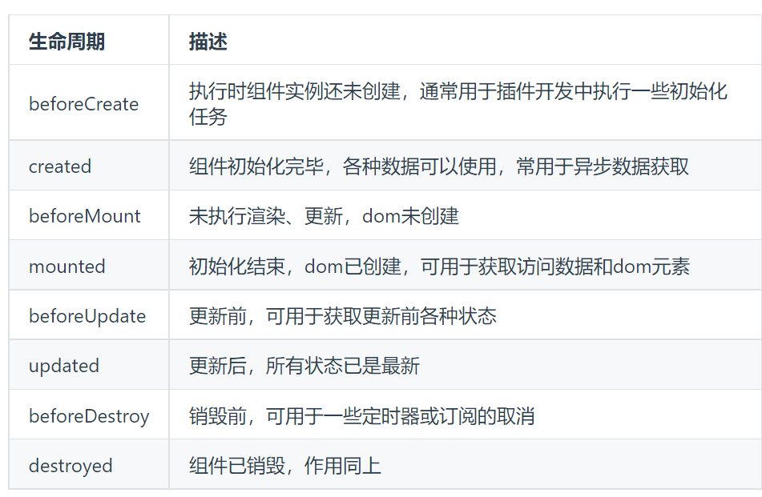

# 面试题

## 1、对HTTP1.0、HTTP1.1、HTTP2.0有所了解吗？
参考文章：

[面试官：说说 HTTP1.0/1.1/2.0 的区别?](https://vue3js.cn/interview/http/1.0_1.1_2.0.html)

##### HTTP1.0：浏览器和服务器保持短连接，每次和服务器交互，都要创建一次新的连接

例：解析HTML文件的时候，即使文件中存在资源文件，也要创建新的连接。导致一个html文件里包含了多次请求和响应，每次请求都需要创建连接，关系连接，造成性能缺失。

##### http1.1：引入持久连接，即tcp默认不关闭，可被多个请求复用。减少了关闭和建立连接的延迟和消耗。

例：在加载html文件时，文件中多个请求和响应在一个连接上传输。

- 即使可以复用tcp连接，但在一个tcp连接里，所有的数据通信按序进行。服务器处理完一个请求才能处理下一个。

- 在1.0的基础上，增加更多请求头和响应头

- 增加更多请求方法

##### http2.0：

- 采用二进制格式而非文本格式传输数据
- 完全多路复用，非有序并阻塞的，只需一个连接即可实现并行
- 使用报头压缩，降低开销
- 服务器推送


## 2、HTTPS是如何实现更加安全的？

参考文章：

[面试官：什么是HTTP? HTTP 和 HTTPS 的区别?](https://vue3js.cn/interview/http/HTTP_HTTPS.html)

[面试官：为什么说HTTPS比HTTP安全? HTTPS是如何保证安全的？](https://vue3js.cn/interview/http/HTTPS.html)

## 3、进程和线程有什么区别？

参考文章：

[面试官：说说什么是进程？什么是线程？区别](https://vue3js.cn/interview/linux/thread_process.html)

进程是对正在运行中的程序的一个抽象,进程是操作系统资源分配的基本单位，而线程是任务调度和执行的基本单位

线程在进程中执行

一个进程可包含多个线程

进程之间资源不能共享，线程间资源可以共享

进程消耗cpu更多资源

进程间互不影响，但一个线程挂了整个进程就挂


## 4、es6相对于es5新特性

如果问这个，你能想到什么？？

es5:定义变量用var，es6用let和const

es5使用加号拼接变量和字符串，es6用模板字符串反引号（`my name is ${name}`）

es5属性放在构造函数里，方法放在原型上；es6引入了类来代替构造函数

es6中，可以使用==解构==从数组和对象提取并赋值给独特的变量

==for...of==循环可以循环任何可迭代变量（String、array、map、set不包括对象）

==展开运算符==将字面量对象展开为多个元素

==箭头函数==`=>`不只是关键字function的简写，它还带来了其它好处。箭头函数与包围它的代码共享同一个`this`,能帮你很好的解决this的指向问题

==Promise==异步编程的一种解决方案

==对象==属性简写

==导入==import、==导出==export

## 5、vue生命周期有哪些？3.0新加了哪些？父子组件生命周期先后顺序？

参考文章

[Vue文档](https://v3.cn.vuejs.org/)

[面试官：请描述下你对vue生命周期的理解？](https://vue3js.cn/interview/vue/lifecycle.html)



##### 数据请求在created和mouted的区别？

created是组件实例一旦创建完成的时候立即调用，dom节点并未生成

```js
//vue3先导入生命周期函数，再在setup里调用
import { onBeforeMount, onMounted, onBeforeUpdate, onUpdated, onBeforeUnmount, onUnmounted, onActivated, onDeactivated, onErrorCaptured } from 'vue'

export default {
  setup() {
    onBeforeMount(() => {
      // ... 
    })
    onMounted(() => {
      // ... 
    })
    onBeforeUpdate(() => {
      // ... 
    })
    onUpdated(() => {
      // ... 
    })
    onBeforeUnmount(() => {
      // ... 
    })
    onUnmounted(() => {
      // ... 
    })
    onActivated(() => {
      // ... 
    })
    onDeactivated(() => {
      // ... 
    })
    onErrorCaptured(() => {
      // ... 
    })
  }
}
```


## 6、说说你知道的排序算法的时间和空间复杂度，知道多少说多少

参考文章：

[面试官：说说常见的排序算法有哪些？区别？(https://vue3js.cn/interview/algorithm/sort.html)

## 面经测试

[美团面经](https://www.nowcoder.com/discuss/815431?type=post&order=recall&pos=&page=1&ncTraceId=&channel=-1&source_id=search_post_nctrack&gio_id=B7C3A0DEA789A6A9D30D6FAF97F67F61-1642913371929)

**如果是你自己面试美团，看看能回答几道题。每个题目都要自己亲自尝试去说。如果不会的题目需要，怎么跟面试官表示自己不会这题。**

