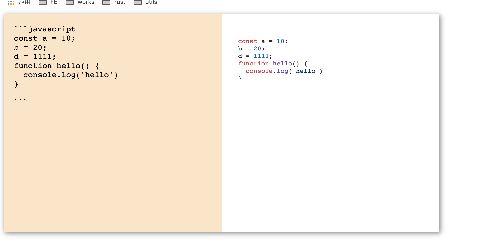

## 具体实现

### 1. 布局


```vue
<template>
  <div class="container">
    <textarea class="edit"></textarea>
    <div class="preview"></div>
  </div>
</template>

<script>
export default {
  name: "MarkdownEdit",
};
</script>

<style lang="scss" scoped>
.container {
  display: inline-flex;
  box-shadow: 2px 2px 10px gray;
  .edit {
    border: none;
    width: 400px;
    height: 400px;
    background-color: bisque;
    resize: none;
    font-size: 16px;
    padding: 20px;
  }
  .preview {
    padding: 20px;
    width: 400px;
    height: 400px;
  }
}
</style>

```

大概布局示例为这样：


### 2. 实现渲染

接下来就需要思考如何将 「编辑区」 输入的markdown语法解析成html标签并最终渲染在 「展示区」

查找了一下目前比较优秀的markdown解析的开源库，常用的有三个，分别是Marked、Showdown、markdown-it ，并借鉴了一下其它大佬的想法，了解了一下这三个库的优缺点，对比如下：

| 库名      | 优点 | 缺点 |
| ----------- | ----------- | ----------- |
| Marked      | 性能好，正则解析（中文支持比较好|  扩展性较差|  
| Showdown   | 扩展性好、正则解析（中文支持好）| 性能较差 |
| markdown-it  | 扩展性好、性能较好 | 逐字符解析（中文支持不好） |

markdown-it使用的人也多，生态比较好，虽然其官方没有支持很多扩展的语法，但是已经有很多基于makrdown-it的功能扩展插件了，最重要的是markdown-it的官方文档写得好啊（而且有中文文档）！

所以我们使用markdown-it库

```shell
  npm i markdown-it --save
```

接下来写一下markdown语法解析的代码吧（其中步骤1、2、3表示的是markdown-it库的用法）

```vue
<template>
  <div class="container">
    <textarea class="edit" v-model="editString"></textarea>
    <div class="preview" v-html="htmlString"></div>
  </div>
</template>

<script>
// 1. 引入markdown-it库
import markdownIt from "markdown-it";
import { ref, computed } from "vue";
export default {
  name: "MarkdownEdit",
  setup() {
    // 2. 生成实例对象
    const md = new markdownIt();

    const editString = ref(""); // 存储编辑字符串
    const htmlString = computed(() => {
      // 解析后的html字符串
      return md.render(editString.value);
    });

    return {
      editString,
      htmlString,
    };
  },
};
</script>

```

示例图片：


### 3、代码块高亮

markdown语法的解析已经完成了，并且也有对应的样式了，但是代码块好像还没有高亮样式

这块儿我们自己来从0到1的实现是不可能的，可以用现成的开源库 highlight.js

```shell
npm install highlight.js
```

之后我们就可以使用hight.js了

```vue
<script>
import { ref, computed } from "vue";
// 1. 引入markdown-it库
import markdownIt from "markdown-it";
import hljs from "highlight.js"; // 引入highlight.js库
import "highlight.js/styles/github.css"; // 引入github风格的代码高亮样式

export default {
  name: "MarkdownEdit",
  setup() {
    // 2. 生成实例对象
    const md = new markdownIt({
      // 设置代码高亮的配置
      highlight: function (code, language) {
        if (language && hljs.getLanguage(language)) {
          try {
            return (
              `<pre><code class="hljs language-${language}">` +
              hljs.highlight(code, { language }).value +
              "</code></pre>"
            );
          } catch (__) {}
        }
        return (
          '<pre class="hljs"><code>' +
          md.utils.escapeHtml(code) +
          "</code></pre>"
        );
      },
    });

    const editString = ref(""); // 存储编辑字符串
    const htmlString = computed(() => {
      // 解析后的html字符串
      return md.render(editString.value);
    });

    return {
      editString,
      htmlString,
    };
  },
};
</script>
```

示例图片：



### 4. 同步滚动

markdown编辑器还有一个重要的功能就是在我们滚动一个区域的内容时，另一块区域也跟着同步的滚动，这样才方便查看.

刚开始主要实现思路就是当滚动其中一块区域时，计算滚动比例（scrollTop / scrollHeight），然后使另一块区域当前的滚动距离占总滚动高度的比例等于该滚动比例

```vue
<template>
  <div class="container">
    <textarea
      class="edit"
      v-model="editString"
      ref="edit"
      @scroll="handleScrollOnEdit"
    ></textarea>
    <div
      class="preview"
      v-html="htmlString"
      ref="preview"
      @scroll="handleScrollOnPreview"
    ></div>
  </div>
</template>

<script>
import { ref, computed } from "vue";
// 1. 引入markdown-it库
import markdownIt from "markdown-it";
import hljs from "highlight.js"; // 引入highlight.js库
import "highlight.js/styles/github.css"; // 引入github风格的代码高亮样式

export default {
  name: "MarkdownEdit",
  setup() {
    // 2. 生成实例对象
    const md = new markdownIt({
      // 设置代码高亮的配置
      highlight: function (code, language) {
        if (language && hljs.getLanguage(language)) {
          try {
            return (
              `<pre><code class="hljs language-${language}">` +
              hljs.highlight(code, { language }).value +
              "</code></pre>"
            );
          } catch (__) {}
        }
        return (
          '<pre class="hljs"><code>' +
          md.utils.escapeHtml(code) +
          "</code></pre>"
        );
      },
    });

    const edit = ref(null); // 编辑区元素
    const preview = ref(null); // 预览区元素

    const handleScrollOnEdit = (event) => {
      let { scrollHeight, scrollTop } = event.target;
      let scale = scrollTop / scrollHeight; // 滚动比例
      // 当前滚动的是编辑区
      // 改变预览区的滚动距离
      let { scrollHeight: previewScrollHeight } = preview.value;
      preview.value.scrollTop = previewScrollHeight * scale;
    };

    const handleScrollOnPreview = (event) => {
      let { scrollHeight, scrollTop } = event.target;
      let scale = scrollTop / scrollHeight; // 滚动比例
      // 当前滚动的是编辑区
      // 改变预览区的滚动距离
      let { scrollHeight: editScrollHeight } = edit.value;
      edit.value.scrollTop = editScrollHeight * scale;
    };

    const editString = ref(""); // 存储编辑字符串
    const htmlString = computed(() => {
      // 解析后的html字符串
      return md.render(editString.value);
    });

    return {
      editString,
      htmlString,
      handleScrollOnEdit,
      handleScrollOnPreview,
      edit,
      preview,
    };
  },
};
</script>

<style lang="scss" scoped>
.container {
  display: inline-flex;
  box-shadow: 2px 2px 10px gray;
  .edit {
    border: none;
    width: 400px;
    height: 400px;
    background-color: bisque;
    resize: none;
    font-size: 16px;
    padding: 20px;
    overflow-y: auto;
  }
  .preview {
    padding: 20px;
    width: 400px;
    height: 400px;
    overflow-y: auto;
  }
}
</style>
```

示例图片:

