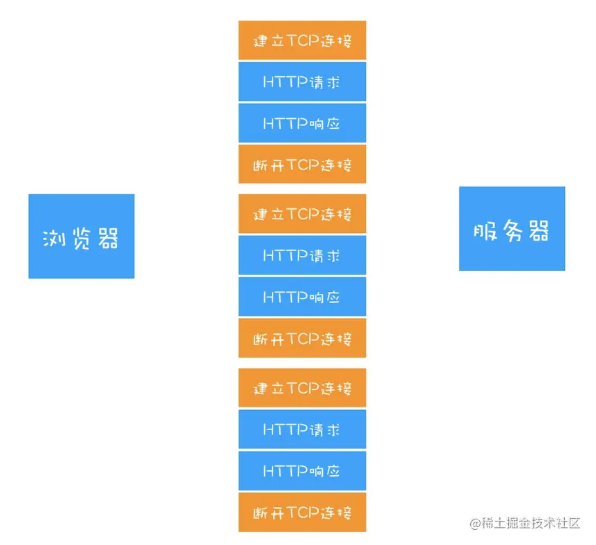
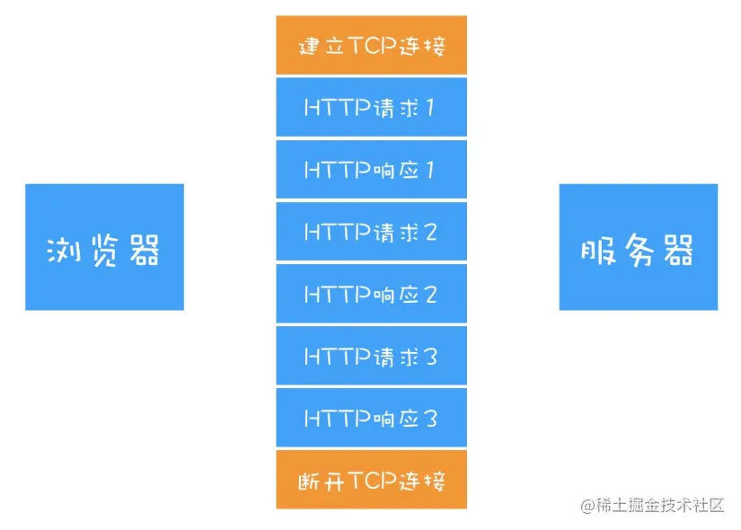
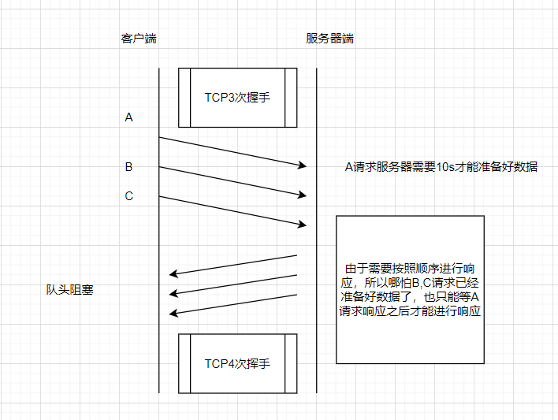
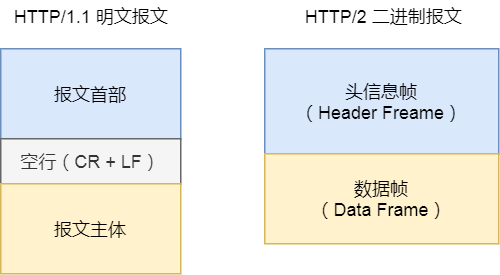
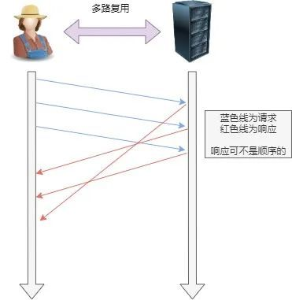

# HTTP1.0、HTTP1.1 和 HTTP2.0 的区别

[toc]

## HTTP的历史

早在 HTTP 建立之初，主要就是为了将超文本标记语言(HTML)文档从Web服务器传送到客户端的浏览器。所以一般指需要请求一个HTML静态文件即可。但随着时代的发展，我们的页面变得复杂，不仅仅单纯的是一些简单的文字和图片，同时我们的 HTML 页面有了 CSS，Javascript，来丰富我们的页面展示，当 ajax 的出现，我们又多了一种向服务器端获取数据的方法，这些其实都是基于HTTP 协议的。这使得我们开始了不得不对 HTTP 进行深入理解并不断优化过程中。

## HTTP1.0

HTTP1.0是浏览器和服务器一次短暂的链接。即浏览器每次请求都需要与服务器建立一个TCP连接，服务器处理完成以后立即断开TCP连接。

随着时代的发展，我们在一个页面中，可能存在CSS, JS, AJAX 等数十次的网络请求，每次发送请求，都需要进行一次TCP连接，而TCP的连接释放过程又是比较费事的。这种无连接的特性会使得网络的利用率变低。

这也就是HTTP1.0存在的问题，**无法复用链接**。而这在HTTP1.1也进行了改进。

## HTTP1.1

HTTP1.1继承了HTTP1.0的简单，克服了HTTP1.0性能上的问题。

### 长连接

HTTP1.1增加了持久连接的方法，它的特点是在一个TCP连接上可以传输多个HTTP 请求，只要浏览器或者服务器没有明确断开连接，那么该TCP连接会一直保持。

从上图可以看出，HTTP的持久连接可以有效减少TCP建立连接和断开连接的次数，这样的好处是减少了服务器额外的负担，并提升整体HTTP的请求时间。

持久连接在HTTP/1.1中是默认开启的，所以你不需要专门为了持久连接去HTTP请求头设置信息，如果你不想要采用持久连接，可以在HTTP请求头中加上Connection: close。目前浏览器中对于同一个域名，默认允许同时建立`6个TCP持久连接`。

### HTTP1.1存在的问题

1. TCP的慢启动

一旦一个TCP连接建立之后，就进入了发送数据状态，刚开始TCP协议会采用一个非常慢的速度去发送数据，然后慢慢加快发送数据的速度，直到发送数据的速度达到一个理想状态，我们把这个过程称为`慢启动`。

你可以把每个TCP发送数据的过程看成是一辆车的启动过程，当刚进入公路时，会有从0到一个稳定速度的 提速过程，TCP的慢启动就类似于该过程。

慢启动是TCP为了减少网络拥塞的一种策略，我们是没有办法改变的。

而之所以说慢启动会带来性能问题，是因为页面中常用的一些关键资源文件本来就不大，如HTML文件、 CSS文件和JavaScript文件，通常这些文件在TCP连接建立好之后就要发起请求的，但这个过程是慢启动，所以耗费的时间比正常的时间要多很多，这样就推迟了宝贵的首次渲染页面的时间了。

2. 队头阻塞问题

什么是队头阻塞问题？

我们知道HTTP1.1可以复用TCP链接，有点类似于在一次的TCP链接建立起了一条管道，多次的请求和响应都在这条管道上进行。我们虽然可以在一条管道上发起多次请求，但请求本身的发起是有先后顺序的，同时要求服务器的返回也需要按照这个顺序返回，不然无法识别响应对应哪个请求。

## HTTP2.0

为了解决HTTP1.1的问题，也为了进行更多的优化，HTTP2.0产生了。

HTTP2.0的改进有以下几点：

### 二进制格式

HTTP1.x的解析是基于文本。基于文本协议的格式解析存在天然缺陷，文本的表现形式有多样性，要做到健壮性考虑的场景必然很多，二进制则不同，只认0和1的组合。基于这种考虑HTTP2.0的协议解析决定采用二进制格式，实现方便且健壮。

### 头部压缩

由于我们会发送多个请求，在每个请求上的请求头都有很多重复的，内容相同的字段。为了消除重复发送。HTTP2.0会对头信息表，这就是所谓的 HPACK 算法：在客户端和服务器同时维护一张头信息表，所有字段都会存入这个表，生成一个索引号，以后就不发送同样字段了，只发送索引号，这样就提高速度了。

### 多路复用

由于HTTP2.0报文以二进制的形式编码，同时将其分为多个帧，叫做二进制帧，同一个请求的二进制帧带有相同的标识，供接收方将其拼凑成一个完整的报文。这样只要哪个数据准备好了就能立即发送，不用按照顺序进行发送。

HTTP/2 是可以在一个连接中并发多个请求或回应，而不用按照顺序一一对应。移除了 HTTP/1.1 中的串行请求，不需要排队等待，也就不会再出现「队头阻塞」问题，降低了延迟，大幅度提高了连接的利用率。

举例来说，在一个 TCP 连接里，服务器收到了客户端 A 和 B 的两个请求，如果发现 A 处理过程非常耗时，于是就回应 A 请求已经处理好的部分，接着回应 B 请求，完成后，再回应 A 请求剩下的部分。

### 服务器推送

HTTP/2 还在一定程度上改善了传统的「请求 - 应答」工作模式，服务不再是被动地响应，也可以主动向客户端发送消息。

举例来说，在浏览器刚请求 HTML 的时候，就提前把可能会用到的 JS、CSS 文件等静态资源主动发给客户端，减少延时的等待，也就是服务器推送（Server Push，也叫 Cache Push）。

或者在有什么信息需要通知用户的时候，我们可以通过HTTP2.0直接由服务器端推送给用户，不用等用户主动请求。

