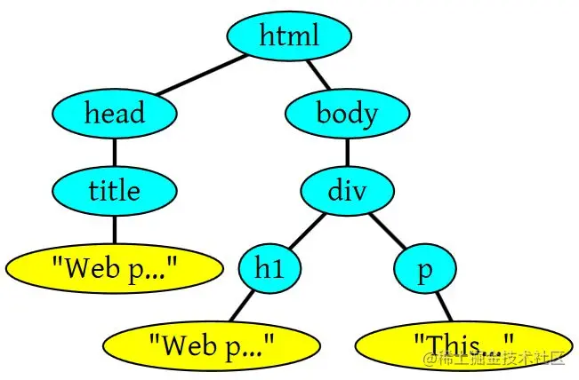
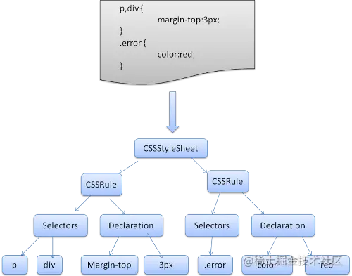
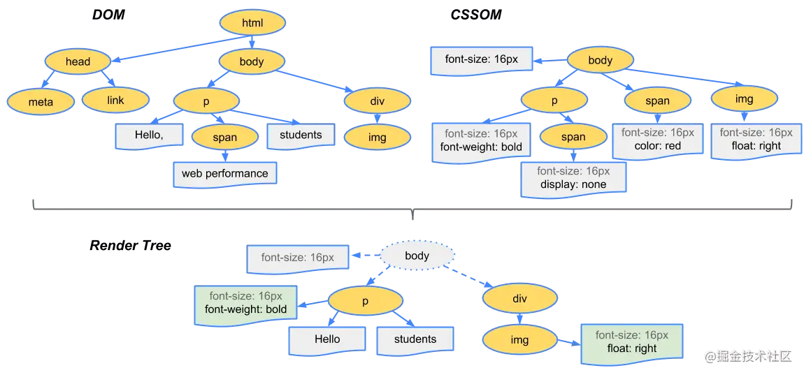
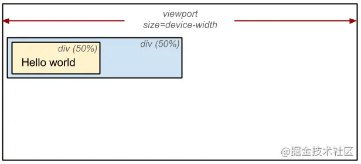

# 从用户输入浏览器输入url到页面渲染过程

首先我们需要了解，用户输入Url到整个页面渲染出来有网络请求部分还有页面渲染部分。

## 网络请求

首先我们需要知道，在整个网络请求过程中，分为客户端(浏览器端) <=> 服务器端。客户端发送请求是需要知道服务器的**ip**地址的，但通常我们只知道网页网址。那么这个Ip地址是如何获得呢？

这一切都要靠DNS服务器。

你可以把DNS服务器相信成一个巨大的数据库。里面包括了所有注册域名和IP地址的数据。

所以当用户输入的时候url到获得服务器响应的流程如下。

1. 用户输入URL地址
2. 浏览器解析URL，**浏览器先查找本地DNS缓存列表 没有的话 再向浏览器默认的DNS服务器发送查询请求,同时缓存到本地的DNS列表**

3. 浏览器向服务器发送HTTP请求。(Request)
4. 服务器向浏览器返回HTTP响应。(Response)

## 页面渲染

我们通过上面的流程，可以获得一个响应。如果浏览器拿到的是Html文档，就会把这个页面渲染出来。所以我们前端项目里都有一个`index.html`文件。我们就需要仔细了解浏览器渲染文档的过程。

会有以下几个环节


### 1. HTML解析

浏览器中的`HTML 解析器(HTML Parser)`将HTML标记语言解析成DOM Tree

举个例子：一段HTML

```html
<html>
<head>
    <title>Web page parsing</title>
</head>
<body>
    <div>
        <h1>Web page parsing</h1>
        <p>This is an example Web page.</p>
    </div>
</body>
</html>
```



**为什么是树型结构？将文本的HTML文档，提炼出关键信息，嵌套层级的树形结构，便于计算拓展。**

### 2. CSS解析

浏览器中的`CSS解析器(CSS Parser)`CSS解析成CSSOM（CSS Object Model）,它也是一个树形结构。

类似与下面的这样的结构。



### 3. 构建 渲染树（render tree）

这里多了一个渲染树的概念，什么叫渲染树呢？**你可以理解为DOM Tree 和 CSSDOM Tree的结合。**

下图 Render Tree 就是由 DOM Tree 结合CSSOM而来的，



为了构建渲染树，浏览器主要完成了以下工作：

1. 从DOM树的根节点开始遍历每个可见节点。
2. 对于每个可见的节点，找到CSSOM树中对应的规则，并应用它们。
3. 根据每个可见节点以及其对应的样式，组合生成渲染树。

第一步中，既然说到了要遍历可见的节点，那么我们得先知道，什么节点是不可见的。不可见的节点包括：

- 一些不会渲染输出的节点，比如script、meta、link等。

- 一些通过`css`进行隐藏的节点。比如`display:none`。注意，利用`opacity`进行隐藏的节点，还是会显示在渲染树上的。只有`display:none`的节点才不会显示在渲染树上。

**注意：渲染树只包含可见的节点**

### 3. 计算布局(Layout)

创建渲染树后，下一步就是进行布局的计算。

**这个过程就是通过渲染树中渲染对象的信息，计算出每一个渲染对象的位置和尺寸，将其安置在浏览器窗口的正确位置。**

有些时候我们会在文档布局完成后对DOM进行修改，这时候可能需要重新进行布局，也可称其为**回流**，本质上还是一个布局的过程，

为了弄清每个对象在网站上的确切大小和位置，浏览器从渲染树的根节点开始遍历，我们可以以下面这个实例来表示：

```html
<!DOCTYPE html>
<html>
  <head>
    <meta name="viewport" content="width=device-width,initial-scale=1">
    <title>Critial Path: Hello world!</title>
  </head>
  <body>
    <div style="width: 50%">
      <div style="width: 50%">Hello world!</div>
    </div>
  </body>
</html>

```

我们可以看到，第一个div将节点的显示尺寸设置为视口宽度的50%，第二个div将其尺寸设置为父节点的50%。而在布局这个阶段，我们就需要根据视口具体的宽度，将其计算出实际的像素值。（如下图）



### 4. 绘制(Painting)

在绘制阶段，系统会遍历渲染树，并调用渲染器的“paint”方法，将渲染树的内容显示在屏幕上。绘制工作是使用用户界面基础组件完成的。

最终，我们通过构造渲染树和布局计算阶段，我们知道了哪些节点是可见的，以及可见节点的样式和具体的几何信息(位置、大小)，那么我们就可以将渲染树的每个节点都转换为屏幕上的实际像素。这样我们就在浏览器中“画出”了具体的页面。

有时候我们会在页面渲染完成之后，修改了节点颜色等属性，这时候我们就需要重新绘制节点。所以这一过程也叫做**重绘节点**。实际上他的本质就是绘制。

### 总结

现在我们看下图来总结以下页面是如何渲染的。


1. HTML解析出DOM Tree
2. CSS解析出CSSOM Tree
3. 将二者关联生成Render Tree
4. Layout 根据Render Tree计算每个节点的信息
5. Painting 根据计算好的信息绘制整个页面
